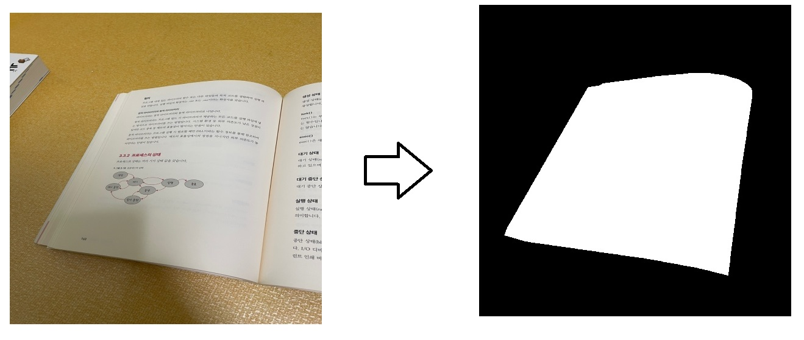

# Mask_generator
## 설명

- 특정 객체의 경계라벨(=마스크 이미지라한다)을 쉽고 빠르게, 아름답게 만들 수 있도록 도와주는 툴이다.
- 이미지에서 특정 객체의 경계를 추출하기위해 openCV라이브러리의 GrabCut 알고리즘을 사용한다. 
- 기본적인 GrabCut 알고리즘에 결과물 이미지 사이즈를 변환하며 픽셀보간(inter nearst) 또는 기타 이유로 발생하는 픽셀노이즈 제거하기위한 Mopology 알고리즘과 수동으로 경계라벨을 지정해줄 때 생기는 경계선의 삐뚤빼뚤함을 보정해주는 알고리즘인 approxPolyDP 를 추가하여 결과물을 빠르고 아름답게 만들어 경계학습모델(이미지 세그먼트 등)에 사용할 수 있다.
- approxPolyDP의 경우 적용시 객체의 아주 미묘한 경계를 정확히 할 수 없다는 한계가 있기 때문에 적절한 매개변수(폴리곤의 단위의 길이)를 찾아 조정해주는것이 좋다.
- The GrabCut algorithm is used to extract objects and create a mask image of the extracted object. This allows for the creation of features (original image) and targets (mask image).

## How to use
- open terminal 
```
python main.py
```
- if you want jupyter, check grabcut.ipynb   

- Select image.
- You can see three windows image, mask, grabcut.
- Adjust the window size appropriately.
- Select the area of the object with a right-click drag and then press 'n' to apply the changes.
- Press the '0' key and use left-click to remove unnecessary parts of the object and then press 'n' to apply the changes.
- Press the '1' key to select the parts to restore and then press 'n' to apply the changes.
- To save, Press the 's' key and then you can continue the work 
- To exit, Press the 'esc' key
- To adjust the pen size, Press the '[' or ']' keys
- To check the results, Look in /output folder
